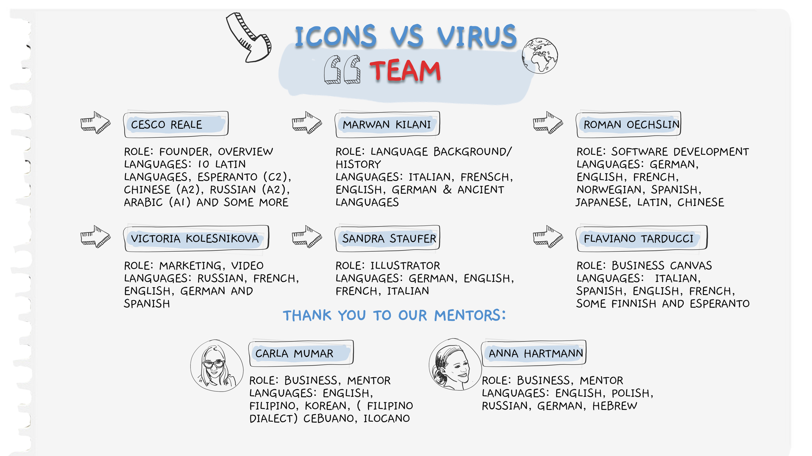

# KomunIKON
This project has been developed in the scope of the VersusVirus hackathon to tackle the COVID-19. The app can be used to translate sentences into icons in order to facilitate communication.
See an in use video of the app below:

# MVP October 2020

